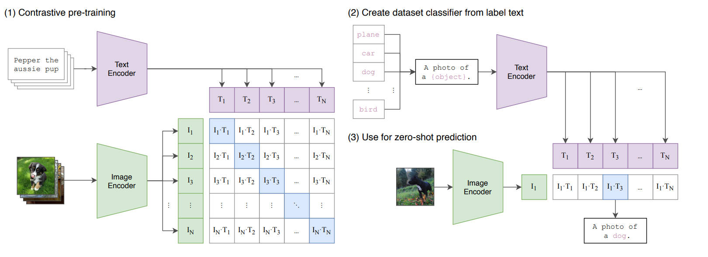

# Learning Transferable Visual Models From Natural Language Supervision

`标题关键词：Transferable、Natural Language`

#### Abstract

`动机：一个数据集所预测的类别是固定的，这样训练出来的模型丧失了泛化性。`

`方法：用自然语言信息来代替标签文件信息，构造数据集——4亿个text-image pairs，用多模态对比学习来完成模型的训练。`

#### Introduction and Motivating Work

`在NLP领域中，在训练时，一些与特定下游任务无关的预训练模型取得了显著的成果，如BERT、GPT等。能否将这种成功的模式应用到CV领域中呢？`

`有这方面的相关工作，但是效果不太好，其原因在于——算力资源、模型的规模和数据集的规模，即scale`

`CLIP Contrastive Language-Image Pre-training`

#### Approach

##### 	Natural Language Supervision

`本质：就是想把文本做为一个训练的信号`

`动机：1) 不需要对数据进行标注，现在只需要从互联网上下载图片以及它的“配对文字”；2) 利用多模态对比学习能很好地进行迁移，即利于zero-shot transfer`

##### 	Creating a Sufficiently Large Dataset

`4亿个text-image pairs，取名为WIT，即WebImageText`

##### 	Selecting an Efficient Pre-training Method

`训练所需要的资源太大了，所以训练的效率是关键`

`1) image：ResNet或ViT 2) text：CBOW或Text Transformer 3) 训练任务：预测给定图片对应的文本，对比学习的方法`

​	`使用对比学习的方法，大大地简化了训练效率`



```python
# 伪代码
	# I[n, h, w, c] 输入图像
    # T[n, l]		输入文本
    # W_i[d_i, d_e] learned proj of image to embed
    # w_t[d_t, d_e] learned proj of text to embed
    # t learned temperature parameter，对比学习中很重要的超参数，但由于数据量过大，不好进行调参，所以在这儿设置为一个可学习量
    
# 多模态特征
I_f = image_encoder(I)	# 输入图像特征
T_f = text_encoder(T)	# 输入文本特征

# 多模态特征
I_e = l2_normalize(np.dot(I_f, W_i), axis=1)
T_e = l2_narmalize(np.dot(T_f, W_t), axis=1)

# 相似度
logits = np.dot(I_e, T_e.T) * np.exp(t)

# ground truth
labels = np.arange(n)

# loss function
loss_i = cross_entropy_loss(logits, labels, axis=0)
loss_t = cross_entropy_loss(logits, labels, axis=1)
loss = (loss_i + loss_t)/2
```

##### 	Training

`有一个Blog，专门讲如何训练的`

#### Experiments

##### 	Zero-Shot Transfer

###### 		Motivation

`不再是representation learning，而是task learning`

###### 		Using CLIP For Zero-Shot Transfer

`就是图中的(2) Create dataset classifier from label text`

###### 		Initial Comparison To Visual N-Grams

`CLIP的效果更佳，但CLIP在计算资源上是N-Grams的1000倍`

###### 		Prompt Engineering And Ensembling

`动机：`

​	`1) 多义性polysemy`

​	`2) 预训练的时候，Text Encoder进来的是句子，所以在Transfer的时，进来的也需要是句子，以避免Distribution Gap，如“A photo of a {label}.”。对于特定的数据集，如数据集中都宠物的图片，还可以加上额外的限制，来让预测更加准确“A photo of a {label}, a type of pet.”`

`至于Prompt Ensembling，就是叠用多个Prompt Template，在CLIP中使用了80个。`

###### 		Analysis of Zero-Shot CLIP Performance

`Zero-Shot CLIP和Linear Probe on ResNet50做对比，给普通物体分类的数据集上，前者效果更好；但对于一些更难的任务，如对纹理进行分类、给图片中的物体计数等，则后者效果更好。`

`还进行了zero-shot、few-shot的比较：Zero-Shot CLIP、Linear-Probe CLIP(1-shot、2-shot、4-shot、8-shot和16-shot)、BiT-M(这个是专门为Transfer量身而定的，是个很强的baseline)`

##### 	Representation Learning

`验证完全使用下游任务的数据，Linear-Probe(冻住backbone，只训练分类头)和Fine-Tuning(整体微调)，本文用的是Linear-Probe。`

​	`为什么选择Linear-Probe？原因如下：`

​		`① Fine-Tuning会影响backbone中的参数，如果之前Pre-Training没训练好，在Fine-Tuning时可能又会训练好，而Linear-Probe只会改动FC中的参数，如果在Pre-Training时没训练好，即使FC训练的再好，效果也不会提升过多，这是第一条原因。`

​		`② Linear-Probe相比于Fine-Tuning，所需要调的参数更少。`

#####   	Robustness to Natural Distribution Shift

#### Comparison to Human Performance

`启发：1) 先验知识；2) 对于人很难的类别对CLIP而言也很难。`

#### Data Overlap Analysis

`防止测试数据，在训练阶段时就已经“见过了”`

#### Limitations

`① CLIP对于State-of-the-Art而言，还是差了十几个点，本文作者估计，为了弥补这些点，需要x1000倍的算力资源；`

`② 在较难任务的数据集上，它的Zero-Shot Transfer的效果不理想；`

`③ 对于一些out-of-distribution的数据集，效果也不好，如MNIST`

`④ 思路是，针对一张图片，给出很多种可能的类型，让CLIP预测是哪一种类型；作者提出一种改进的想法，应该让模型直接给图片起一个Caption，既让模型将对比学习模型的高效性和生成式模型的灵活性结合起来。`

`⑤ 32个epoch，每个epoch跑了4亿图片对，即12.8billion，每秒钟出一对文本和图片，则需要405年。自监督和伪标签的方式相比于监督学习能更好地提高数据的使用效率。`

`⑥ 需要新的数据集来检测迁移学习的效果`

`⑦ 网络上直接得到的数据，未经清洗，所以模型会带有bias`

`⑧ 从Zero-Shot CLIP调整为1-shot、2-shot或其他时，效果可能会下降。这与Zero-Shot Human调整为1-shot、2-shot或其他时，所得到的效果相反。`

#### Broader Impacts

###### 	Bias

###### 	Surveillance

###### 	Future Work

#### Related Work

#### Conclusion

​	`打破了传统的范式`

---

#### Google Colab上使用：


