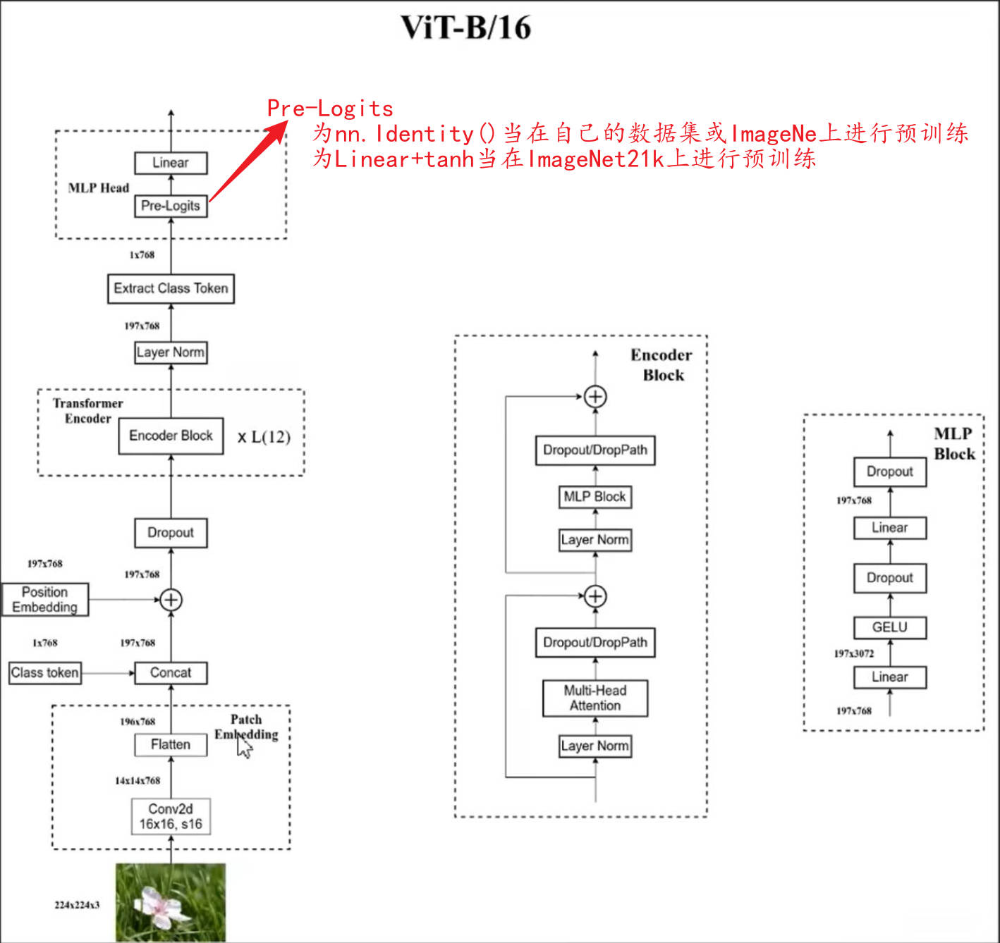

1. 准备数据集：[flower数据集-百度网盘分享](链接：https://pan.baidu.com/s/1ik6-Qd8YFIENtPB_8_qZ9Q?pwd=tq49 
   提取码：tq49 
   复制这段内容后打开百度网盘手机App，操作更方便哦

2. [)

   ```python
   "./FineTuneDataset/flower_photos"
   ```

   如果需要使用自己的数据集，请按照花分类数据集的文件结构进行设置，并更改train.py和predict.py中的num_classes为你自己数据的类别数

3. 准备预训练权重：

   ```python
   "./PreTrainModel/jx_vit_base_patch16_224_in21k-e5005f0a.pth"
   ```

   本人使用的模型是ViT-Base-patch16-rawimg224-ImageNet21k：[预训练权重下载路径](https://github.com/rwightman/pytorch-image-models/releases/download/v0.1-vitjx/jx_vit_base_patch16_224_in21k-e5005f0a.pth)

4. 修改train.py

```python
# 将'--data-path'的default设置为"./FineTuneDataset/flower_photos"
# 将'--weights'的default设置为"./PreTrainModel/jx_vit_base_patch16_224_in21k-e5005f0a.pth"
```

4. 运行train.py

```python
'''会生成以下4个文件
class_indices.json
runs
weights
__pycache__
'''
```

---

5. 修改predict.py

```python
# 设置model_weight_path为"./weights/model-9.pth"
# 设置img_path为"./LoadImage/tulip.jpg"
```

6. 运行predict.py

---



